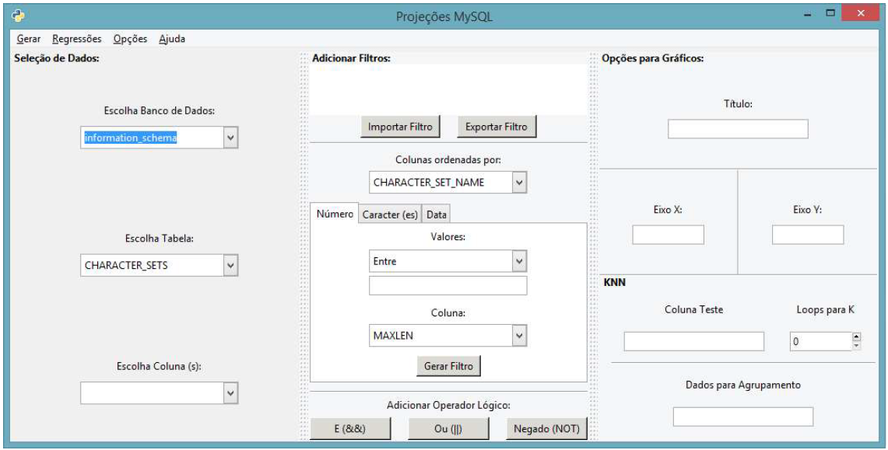
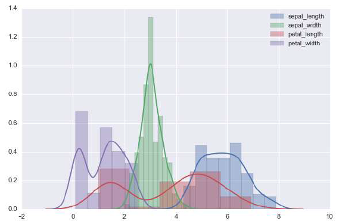
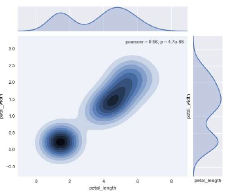
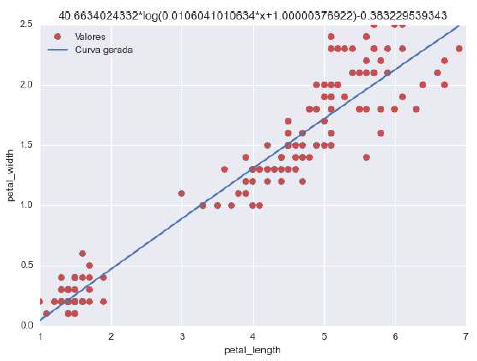
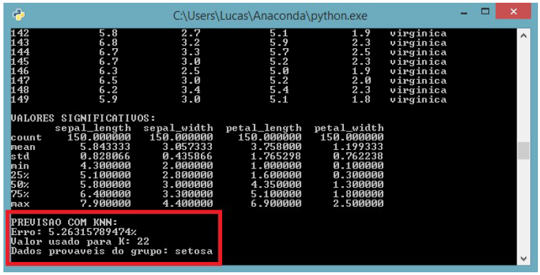

# MySQL-Projections
Interface developed in cientific iniciation on UFRGS (Brazil) to handle data from MySQL databases. Full user manual available in portuguese.

The interface is able to connect with a MySQL login account and use the information of the databases of it. Is possible to filter and plot the data in different settings chose intuitively by the user. Besides that, the program has a naive machine learning option with regressions and KNN predictions.

## Prerequisites

- Python 2.7 (not tested with superior versions);
- MySQL;
- Gtk;
- PyGtk;
- MySQLdb;
- Getpass;
- Pandas;
- Numpy;
- Matplotlib;
- Scipy;
- Seaborn;
- Scikit-learn;

## General view

Some images of the interface functionality.

### Main screen

### Density plot

### Proximity plot

### Logarithm regression

### KNN prediction

