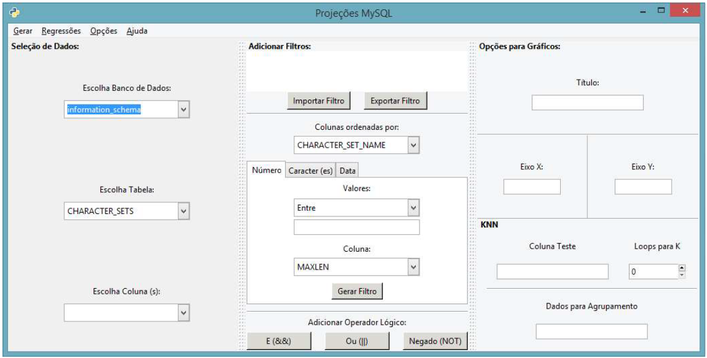
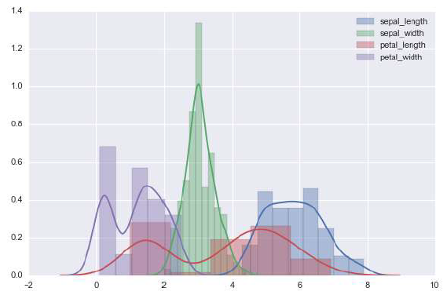
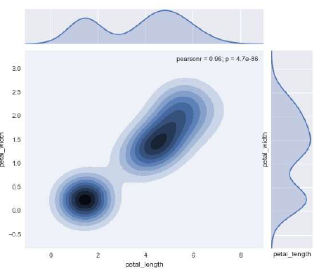
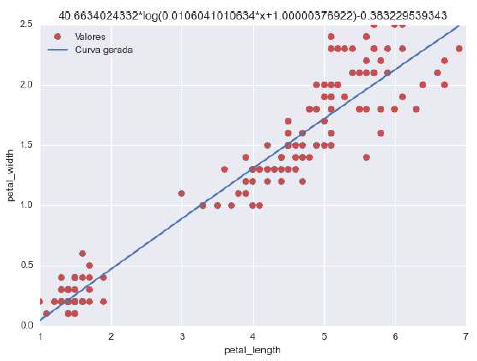
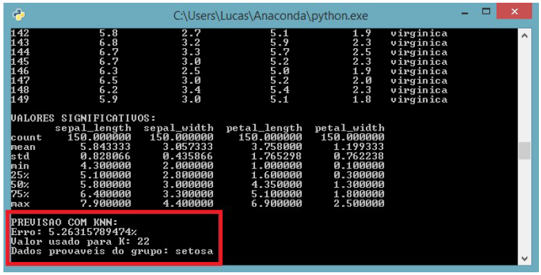

# MySQL-Projections (Projeções MySQL)
Interface developed in cientific iniciation on UFRGS (Brazil) to handle data from MySQL databases. Full user manual available in portuguese.

The interface is able to connect with a local MySQL login account and acess the information of the databases of it. Is possible to filter and plot the data in different settings chose intuitively by the user. Besides that, the program has a naive machine learning option with regressions and KNN predictions.

>Interface desenvolvida em bolsa de iniciação científica na UFRGS para lidar com dados de um banco MySQL. Manual do usuário disponível totalmente em português. A interface é capaz de se conectar a uma conta MySQL local e acessar as informações de seus bancos de dados. É possível fazer filtragem e gráficos dos dados com diferentes opções escolhidas de forma intuitiva pelo usuário. Além disso, o programa implementa uma forma simples de aprendizado de máquina utilizando regressões e predições com o algorítmo KNN.

## Prerequisites (Pré-requisitos)

- Python 2.7 (not tested with superior versions);
- MySQL;
- Gtk;
- PyGtk;
- MySQLdb;
- Getpass;
- Pandas;
- Numpy;
- Matplotlib;
- Scipy;
- Seaborn;
- Scikit-learn;

## General view (Visão geral)

Some images of the interface functionality (see more in the user guide).

>Algumas imagens da funcionalidade da interface (veja mais no manual do usuário).

### Main screen (Tela principal)

### Density plot (Gráfico de densidade)

### Proximity plot (Gráfico de proximidade)

### Logarithm regression (Regressão logarítma)
Logarithm regression using the data base **iris**.

>Regressão logarítma utilizando o banco de dados **iris**.

### KNN prediction (Predição KNN)
KNN prediction of the plant's species using the data base **iris**.

>Previsão KNN da espécie de planta utilizando o banco de dados **iris**.

